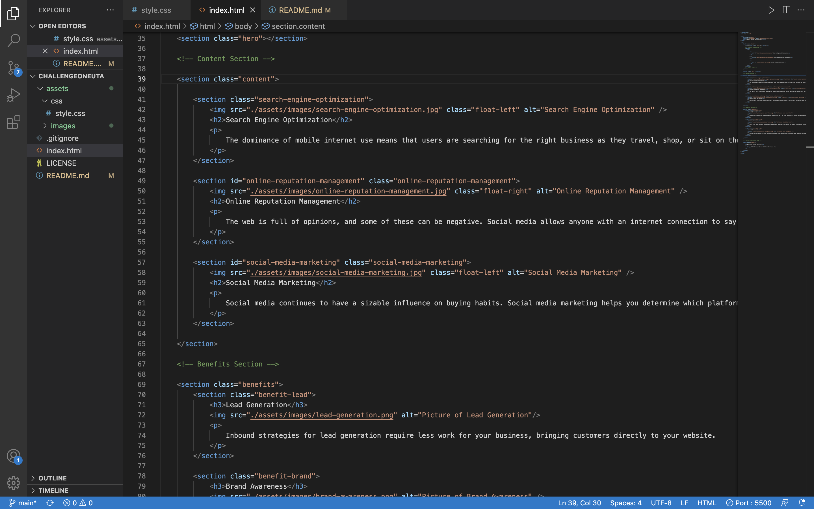
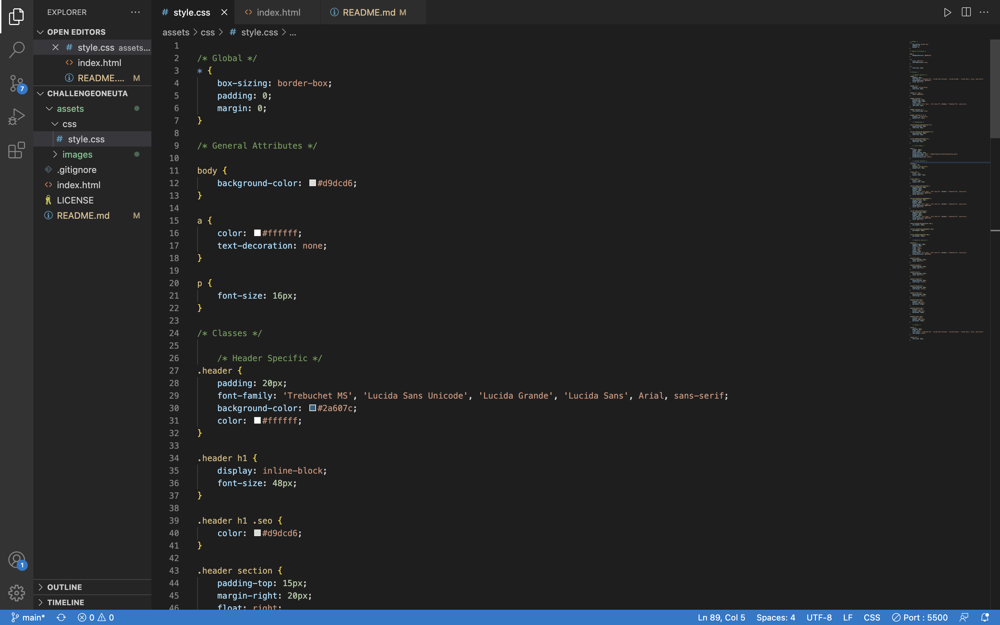

# ChallengeOneUTA

## Description

This repo contains my first challenge of the Full Stack coding bootcamp offered by the University of Texas at Austin. 

The challenge I was given was to refactor the starter code I was given to include semantic HTML elements for better accessibilty by disabled people. I was also challenged to follow the "scout rule" by leaving the code cleaner than I found it.

Link to website for viewing:

https://opaleone.github.io/ChallengeOneUTA/

    Preview of Accessibility Changes

    Preview of CSS organization

Firstly, I made the code more accessible by including semantic HTML elements. The way I did this is by replacing all the HTML elements that were divs with an element called section. This enables machines to read out new section to someone who might be disabled and allows them to navigate a page with Sound instead of sight. 

I, also, added alt attributes to IMG tags that will display a description of the image in case the picture doesn't load. This will also read out on a machine to a disabled person and gives them a description of the image.
    
    * Semantic HTML elements are elements that clearly describe their 
    meaning in a human- and machine-readable way.
    
Secondly, I left the code cleaner by doing a few things. The first thing I did was organize the stylesheet according to order of importance. 

I organized global attributes at the top followed by general attributes, classes then finally, ID attributes. This allows any developer who comes behind me to easily find the attribute they are looking for.

To further aid developer behind me, I added comments in key areas to mark sections off and provide an easy coloring scheme for them to follow.

And last but not least, I spaced elements out by include white space between lines of code, aiding in legibility.

## Credits

* University of Texas - Austin - Full Stack Coding Bootcamp
* Stack Overflow
* W3Schools

## License

Please refer to license in the repository.

## Special Thanks

Just wanted to give special thanks to my instructor, Leah, and my TAs, Negrin and Ian, for helping with the challenge!
